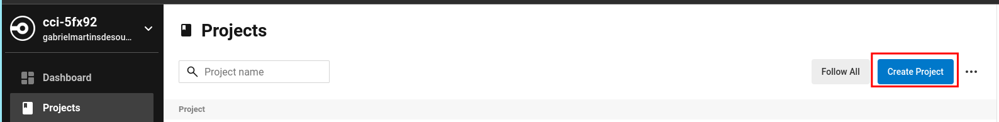

# API-TIRA-DUVIDA-CHATGPT-KENLO

API responsável por enviar uma mensagem do usuário ao ChatGPT e retornar uma resposta

<BR>

## Arquitetura

---

Esse projeto foi desenvolvido em camadas logicas, visando colocar em praticas os principios do SOLID, a modelagem de Dominio Rico utilizado em DDD e alguns Designs Patterns.

<BR>

Abaixo será realizado uma explicação sobre cada camada projeto:

<BR>

### Models

---

Nessa camada estão as classe responsáveis por representar os modelos/entidades da aplicação. Em cada classe foi utilizado a modelagem de Domínio Rico, possibilitando que todas as operações de dados e regras de dominio sejam tratadas diretamente nas classes modelo, evitando a falta de consistência que acontece muitas vezes quando atribuimos essa responsabilidade de validação a uma camada de service, no qual cada service realiza um tipo de validação aos dados da classe modelo.

Juntamente, foi aplicado o conceito de **Single Responsibility** do **SOLID**, no qual cada modelo possui unica e exclusiva a responsabilidade realizar as operações dos dados em nivel de entidade, sem qualquer ação com o banco de dados.

**_OBS: Cada modelo da aplicação possui os seus testes unitários._**

<BR>

### Repositories

---

Nessa camada estão as classes responsáveis por realizar as interações com o banco de dados. Em cada classe foi utilizado o **Design Pattern Repository**, que permite, através da utilização de **interfaces**, o desacoplamento da aplicação com o banco de dados, assim encapsulando a logica de acesso de dados e facilitando os testes unitário da camada de UseCase.

Nesse projeto houveram duas classes de implentações sendo elas:

- **InMemoryUsersRepository:** Classe que simula uma persistencia com o banco de dados, sendo utilizado em testes unitários na camada de UseCase.

- **MongoDBUsersRepository**: Classe que implementa do driver do banco de dados MongoDB, realização os metodos de **_create, find e update_** na base de dados.

<BR>

### Services

---

Nessa camada estão as classes responsaveis por utilizarem algum serviço externo, como por exemplo a API do ChatGPT. Em cada classe foi utilizado o **Abstração** da Orientação a Objeto, gerando o desacoplamento da aplicação com a impletação dos serviços externos, facilitando os testes unitários da camada de UseCase.

<BR>

### UseCases

---

Nessa camada estão as classes responsáveis por realizar as regras de negócio da aplicação. Nessas classes são realizadas o direcionamento das classes de modelo a executarem suas regras de dominio e as funcionalidades das classes da camada Repositories de persistir as informações no banco de dodos, assim chegando ao objetivo do UseCase.

Juntamente, foi aplicado o conceito de **Dependency Inversion Principle** do **SOLID**, no qual o UseCase está dependendo apenas das abstrações e não das implementações das classes das camadas **Repositories** e **Services**.

**_OBS: Cada UseCase da aplicação possui os seus testes unitários._**

<BR>

### Controllers

---

Nessa camada estão as classes responsáveis por receber os dados de entrada da API, já validados, em seguida chamar o Caso de Uso desejado e após a execução realizar uma resposta a requisição em caso de sucesso do caso de Uso.

Vale lembra que nessa camada foi aplicado o Design Pattern de **Injeção de Dependencia**, através da classe **SendMessageFactory**, nela é realizado as instâncias das classes que implementam as interfaces.

**_OBS:_** **_Cada Controller da aplicação possui os seus testes de Integração._**

<BR>

### Schemas

---

Nessa camada estão as classes responsáveis por estabelecer as validações nos dados informados API através de um requisição. Essas classes foram desenvolvidas para serem utilizadas pela camada **Middlewares**.

<BR>

### Erros

---

Nessa camada estão as classe de erros personalizados da aplicação. Essas classes são utilizada pelas classes da camada Models e Camada UseCase. No caso de alguma excessão, esse erros são lançados, com isso facilitando uma possível correção de bug e também retornando uma resposta a mensagem e o status correto do ocorrido, pois cada classes de erro retorna um tipo de HTTP Status Code.

<BR>

### Middlewares

---

Nessa camada estão os métodos que serão utilizados nas rotas do **Express**. Esses metodos possuem funções diversas sendo:

- **handlerErrors:** Método responsável por receber as excessão geradas pela aplicação e retornar uma resposta para a requisição. Esse método obtém o HTTP Status Code e message informado pelo erro personalizado e retorna uma resposta da requisição.

  Vale ressaltar que o **Express na versão 4** não realiza gerenciamento de erro de funções assincronas, então para que esse handler de erros funcione corretamente, foi necessário adicionar o pacote **express-async-errors**, fazendo com que o handler de erros capture as exceções geradas por funções assincronas.

- **handlerErrors:** Método responsável por aplicar as regras de validações da camada de **Schema**, nos dados de entrada da API.

<BR>

### Routes

---

Nessa camada está a classe que contém as rotas da aplicação, adicionando os middlewares necessários para cada rota e chamando a class Factory que irá instaciar o controller desejado.

<BR>

### Database

---

Nessa camada está o objeto responsável por obter os dados das variáveis de ambiente e gerar uma conexão com o banco de dados MongoDB.

<BR>

### App.ts

---

Esse arquivo possui a responsabilidade de criar a aplicação **Express** e adicionar os middlewares globais necessários para subir a aplicação.

<BR>

### Server.ts

---

Esse arquivo possui a responsabilidade de cria uma conexão com o banco de dados e subir a aplicação Express.

<BR>

### Teste Unitários e Teste de Integração

---

Nesse projeto foi utilizado as bibliotecas Jest e Supertest para realizar os testes. Todos os arquivos com a nomeclatura **.test.ts**, são responsáveis por realizar os testes unitários, já os arquivos com a nomeclatura **.spec.ts**, são responsáveis por realizar os teste de integração.

<BR>

### Padronização de Estilo de Código

---

Para esse fim fora utilizados as seguintes ferramentas:

- **ESlint**: Responsável por identificar padrões de código em desacordo com as regras pré-estabelecidas.
- **Prettier**: Responsável por formatar o código de acordo com essas regras.

<BR>

### Swagger

---

Para documentação da API foi utilizado a ferramenta **Swagger**, nele estão contido as URL da aplicação, as rotas e a explicação da utilização de cada rota.

Para acessar o Swagger basta acessar este [link](https://api-tira-duvida-chatgpt-kenlo.onrender.com/swagger)

<BR>

## Execução do projeto

---

Segue abaixo as maneiras de executar o projeto localmente.

<BR>

### Execução do projeto com Docker

---

<BR>

Para realizar a execução do projeto via docker execute os comandos abaixo:

```bash
# Instale as dependencias do projeto
npm i

# No arquivo docker-compose.yaml adicione a chave para autenticação com a OpenAI
# Para obter essa chave acesse o link: https://platform.openai.com/api-keys
OPENAI_API_KEY= # Chave gerada pela plataforma OpenAI

# Crie os containers da aplicação (NodeJS / MongoDB)
npm run up

# Para remover os container
npm run down
```

**OBS: Não é necessário alterar o arquivo .env pois o arquivo docker-compose já possui as variaveis de ambiente.**

<BR>

### Execução do projeto sem Docker

---

<BR>

Para realizar a execução do projeto via docker execute os comandos abaixo:

```bash
# Instale as dependencias do projeto
npm i

# Crie o arquivo .env
cp .env.example .env

# Altere as variaveis de ambiente com os dados do Banco de dados MongoDB
MONGODB_DATABASE_NAME=xxxx # Nome do Database que será gerado no MongoDB
MONGODB_URL=mongodb://xxxx:yyyy # URL do Servidor do MongoDB
MONGODB_USERNAME=xxxxx # Username utilizado para autenticação com o servidor MongoDB
MONGODB_PASSWORD=xxxx # Password utilizado para autenticação com o servidor MongoDB
PORT=xxxx # Porta da aplicação Express

# Para obter essa chave acesse o link: https://platform.openai.com/api-keys
OPENAI_API_KEY= # Chave gerada pela plataforma

# Para executar o projeto
npm run start:dev
```

<BR>

## Deploy da Aplicação

---

Para realizar o deploy da aplicação em ambiente de produção foram utilizados os seguintes serviços:

- [Github Actions](https://github.com/)
- [Render](https://dashboard.render.com/)
- [Railway](https://railway.app/)
- [CircleCI](https://app.circleci.com/)

<BR>

### Requisitos:

---

- Ter conta criada em todos os serviços citados acima.
- O codigo do projeto deve estar em um repositório do Github

<BR>

## Execução do Deploy

---

1. Acesse a plataforma Railway.
   
   
2. Clique no botão " + New Project".

   
3. Selecione a opção "Provision MongoDB", e aguarde até o serviço ser gerado.
   
   

4. Clique no serviço MongoDB
   
   
5. Acesse o menu variables e guarde as seguintes variáveis que serão utilizadas posteriormente:

   - MONGOHOST - **_OBS: antes da url adicione mongodb:// e pegue o valor que está na variável MONGOPORT e adicione no fim da URL. Ex: mongodb://monorail.proxy.rlwy.net:46434_**
   - MONGOPASSWORD
   - MONGOUSER

    <BR>
    
    

6. Acesse a plataforma CircleCI e clique na opção Project
   
   
7. Clique no botão "Create Project"
   
   
8. No campo "Connect To" selecione a opção Github.com e Siga as orientações abaixo para gerar uma SSH Key para realizar a autenticação com o Github.
   
   
9.  No campo "Repository", selecione o repositorio do projeto e na seção "Select your config.yml file", selecione a opção Fast, adicione um nome ao projeto e clique no botão "Create Project"
    
   
10. Em seguida será exibida uma tela com um editor de texto com um arquivo arquivo no formato .yml. Substitua o conteúdo do editor com os valores exibido abaixo e clique no botão "Commit and Run":

    ```yaml
    version: 2.1
    orbs:
    node: circleci/node@5.1.0

    jobs:
    build_and_test:
      executor:
      name: node/default
      tag: '18.16'
      steps:
        - checkout
        - run: node --version
        - node/install-packages:
            pkg-manager: npm
        - run:
            command: npm run test
            name: Run unit tests
    deploy:
      machine:
      image: ubuntu-2004:current
      resource_class: medium
      steps:
        - run:
            name: Deploy API to Render
            command: |
              response=$(curl -s -w "%{http_code}" -o response.txt $DEPLOY_URI)
              response_code=${response:(-3)}
              if [ $response_code -eq 200 ]; then
              echo "Deployment successful!"
              cat response.txt  # Print the response body
              else
              echo "Deployment failed with response code: $response_code"
              cat response.txt  # Print the response body
              exit 1
              fi

    workflows:
    build_and_test_app:
      jobs:
        - build_and_test
        - deploy:
            requires:
              - build_and_test
            filters:
              branches:
              only: main
    ```

    <BR>

11. Após essa etapa, será gerada uma branch chamada "circleci-project-setup", realize um pull request ou merge para a branch master/main no repositorio do projeto.
    
    
12. Acesse o serviço "Render" e clique no botão "New +", e selecione a opção Web Service.
    
    
13. Na Tela Seguinte Selecione a opção "Build and deploy from a Git repository" e clique em Next.
    
    
14. Na proxima selecione o repositorio desejado clicando em "Connect" e no final da pagina clique em "Create Web Service".
    
15. Na proxima tela, no campo Name adicione um nome para o web service.
    
    
16. Acesse a **opção** "Setting", copie o link do campo "Deploy Hook", e guarde-o.
    
    
17. Acesse novamente o serviço do CircleCI, clique no botão "Project Setting", acesse o menu "Environment Variable" e adicione as seguintes variaveis:

    - MONGODB_URL **_OBS: adicione o valor obtido da variavel MONGOHOST, no passo 5_**
    - MONGODB_PASSWORD **_OBS: adicione o valor obtido da variavel MONGOPASSWORD, no passo 5_**
    - MONGODB_USERNAME **_OBS: adicione o valor obtido da variavel MONGOUSER, no passo 5_**
    - MONGODB_DATABASE_NAME - **_OBS: O valor desse campo deve conter o mesmo nome do database da aplicação api-cadastra-cliente-kenlo_**
    - DEPLOY_URI - **_OBS: Nesse campo utilize o valor do Deploy Hook obtido no passo 16._**
    - OPENAI_API_KEY - **_OBS: Nesse campo utilize a API KEY da OpenAI_**
      

      

    <BR>

18. Após salvar as variaveis de ambiente, a pipeline irá executar automaticamente e com todas as etapas obtendo sucesso, o serviço CircleCI irá acionar o serviço Render para realizar o deploy da aplicação.
    
    

    
